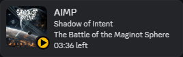

# AIMP - Discord Presence

<p align="center">
  
</p>

Plugin for [AIMP](https://aimp.ru/) that changes the status of Discord, depending on what you are listening to.

## Installation

1. In AIMP, go to Settings >> Plugins.
2. Click on the "Install" button and select the archive with the plugin.
3. Switch on the Discord Presence plugin.
4. In Discord, go to Settings >> Activity Privacy, enable "Share detected activity with others".

## Settings
When closing AIMP, the plugin settings will be added to the configuration file ``Profile/AIMP.ini``. You can find the Profile folder in AIMP settings.

**AIMP must be closed to edit ``Profile/AIMP.ini``.**

Default:
```ini
[DiscordPresence]
ApplicationID=429559336982020107
Timestamp=0 ; (0 - elapsed time / 1 - time remaining | Default: 0)
UseAlbumArt=1
State.PlayImage=aimp_play
State.PauseImage=aimp_pause
State.RadioImage=https://raw.githubusercontent.com/Exle/aimp-discord-presence/main/.github/aimp_icons/animated/aimp_radio_v2.gif
State.UsePlay=0 ; Shows a small image from State.PlayImage (0 - disable / 1 - enable | Default: 0)
State.UsePause=0 ; Shows a small image from State.PauseImage (0 - disable / 1 - enable | Default: 0)
State.UseRadio=1 ; Shows a small image from State.RadioImage (0 - disable / 1 - enable | Default: 1)
```

## Screenshots





